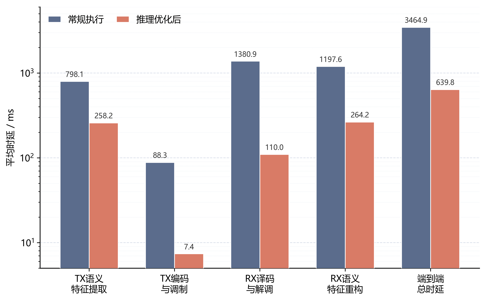

# EdgeSemCom Infra

> An edge-native semantic communication stack spanning VAE feature transport,
> neural physical layers, USRP over-the-air experiments, and Jetson inference
> optimization.

[](https://www.python.org/)
[](LICENSE)
[](https://developer.nvidia.com/embedded/jetson-orin)
[](https://www.ettus.com/all-products/x310-kit/)

[中文说明](README.zh-CN.md) · [Architecture](docs/architecture.md) ·
[Reproduction](docs/reproduction.md) · [Thesis (PDF)](docs/thesis/thesis.pdf)

EdgeSemCom Infra is the cleaned research release of an undergraduate thesis
project. Its primary contribution is not another isolated neural codec: it is
the engineering path that takes learned semantic and physical-layer components
from simulation to an edge device and a real radio link.


## What is included

- **AI infrastructure:** TensorRT-ready VAE paths, TensorFlow graph execution,
  batched baseband processing, model export, and latency benchmarking for
  Jetson Orin.
- **Semantic transport:** VAE latent extraction, Top-K feature selection,
  quantization, LDPC protection, and image reconstruction.
- **Learned PHY:** neural modulation/demodulation, a trainable constellation,
  and staged conventional-versus-neural ablations.
- **Radio adaptation:** pilot synchronization, LS/LMMSE-DFT channel estimation,
  iterative MMSE equalization, and learnable residual correction.
- **Cross-tool deployment:** constellation export for Python/MATLAB and a
  minimal MATLAB lookup modulator/demodulator.
- **Evidence:** selected machine-readable measurements, figures, and the full
  thesis. Large checkpoints and device-specific TensorRT engines are excluded.

## Results at a glance

Measurements below are reported from the archived thesis experiments; they are
hardware- and configuration-dependent, not universal performance claims.

| Measurement | Baseline | Optimized / observed | Change |
|---|---:|---:|---:|
| End-to-end Jetson latency | 3464.9 ms | 639.8 ms | **-81.54%** |
| TX LDPC + modulation | 88.3 ms | 7.4 ms | **-91.62%** |
| RX demodulation + LDPC | 1380.9 ms | 110.0 ms | **-92.03%** |
| OTA image quality (mean) | — | 28.10 dB PSNR / 0.982 SSIM | — |

The learned 16-QAM experiment also produced clearer received clusters than the
standard constellation at the tested PA operating points. See
[results and limitations](docs/results.md) before comparing numbers.



## Repository map

```text
apps/                 end-to-end transmitter and receiver programs
src/edge_semcom/      reusable neural-PHY and USRP-front-end components
training/             neural PHY, constellation, and front-end training
evaluation/           BER/BLER, latency, front-end, and image-quality tools
tools/                checkpoint/ONNX/constellation export utilities
matlab/               learned-constellation bridge for SDR experiments
results/              small, machine-readable reference measurements
assets/               selected architecture and evaluation figures
docs/                 architecture, reproduction notes, model policy, thesis
tests/                 dependency-light repository integrity checks
```

## Quick start

The software has two profiles. Start with simulation; use the Jetson profile
only on a compatible NVIDIA JetPack system.

```bash
git clone <your-repository-url>
cd edge-semcom-infra
python -m venv .venv
source .venv/bin/activate
python -m pip install --upgrade pip
python -m pip install -e ".[simulation,dev]"
pytest
```

Train and compare the modular neural physical layer:

```bash
python training/train_neural_phy.py --epochs 40 --save_dir artifacts/neural-phy
python evaluation/compare_phy_layers.py \
  --neural_model artifacts/neural-phy/best_model.pt \
  --output_dir results/generated/phy-comparison
```

Train a radio-aware 16-QAM constellation and export it for MATLAB:

```bash
python training/train_constellation.py \
  --M 16 --steps 2500 \
  --out_mat artifacts/trained_constellation_16qam_ofdm.mat
```

For the camera-to-camera path, install the project on both endpoints and start
the receiver before the transmitter. Replace paths and addresses for your own
network and model artifacts:

```bash
python apps/receiver.py --host 0.0.0.0 --port 5000 --live --reconstruct \
  --vae_dir /path/to/vae

python apps/transmitter.py --dst RECEIVER_IP --port 5000 --live \
  --vae_dir /path/to/vae --cam_src 0
```

Detailed environment, artifact, and hardware notes are in
[docs/reproduction.md](docs/reproduction.md).

## Design principles

1. **Keep the reliable communications scaffold.** LDPC, pilots, and OFDM remain
   explicit so learned blocks can be replaced and measured independently.
2. **Optimize the whole runtime path.** Model speedups are evaluated together
   with tensor conversion, baseband processing, transport, and reconstruction.
3. **Treat OTA as a separate validation tier.** Simulation results are not
   presented as radio results; raw RF impairments and device configuration are
   documented as experimental factors.
4. **Keep artifacts portable.** Learned constellations can be exported into
   MATLAB-friendly data instead of being trapped inside one checkpoint format.

## Model and data policy

Weights, TensorRT engines, camera recordings, and raw RF captures are not stored
in Git. They are large, hardware-specific, or may carry redistribution/privacy
constraints. Expected locations and naming are described in
[docs/models-and-data.md](docs/models-and-data.md). GitHub Releases or an
external model registry should be used for distributable artifacts.

## Project status

This is a research prototype released for reproducibility and portfolio use.
The simulation and repository-integrity paths are suitable for CI; USRP and
Jetson paths require the corresponding hardware and vendor runtime. The code is
not a production radio stack and must not be used for safety-critical links.

## Citation

If this repository helps your work, cite the thesis using [CITATION.cff](CITATION.cff).

## License

Code in this curated release is available under the [MIT License](LICENSE).
The thesis PDF and result figures remain scholarly works by their author; cite
them when reused. Third-party frameworks and hardware SDKs retain their own
licenses.

