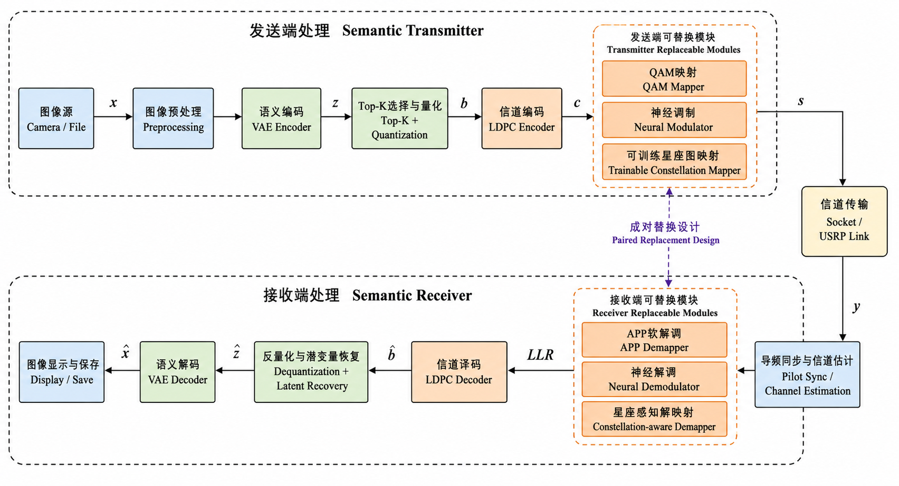

# EdgeSemCom Infra：端侧语义通信基础设施

[English](README.md) · [架构说明](docs/architecture.md) ·
[复现实验](docs/reproduction.md) · [实验结果](docs/results.md)

这是一个面向工程复现的端侧语义通信仓库，主线是把图像语义通信从“模型能运行”
推进到“能在 Jetson Orin 上优化部署，并经过 USRP X310 真实空口验证”。仓库只
保留可解释的核心代码、少量代表性结果与工程文档，不包含论文、重复迭代稿、缓存、
超大权重、设备相关 TensorRT 引擎或原始视频。



## 核心内容

- **AI Infra：** VAE 的 TensorRT/ONNX 导出路径、TensorFlow 图执行、批处理基带
  运算、端侧性能测量与回退机制。
- **语义链路：** VAE 潜变量、Top-K 选择、分位数量化、LDPC 保护和图像重构。
- **神经物理层：** 神经调制/软解调、可训练星座和传统/神经模块分阶段消融。
- **真实链路适配：** 导频同步、LS/LMMSE-DFT 信道估计、迭代 MMSE 均衡和
  可学习残差补偿。
- **跨工具部署：** 将训练星座导出到 MATLAB，并提供查表调制与最近邻解调。

## 代表性结果

以下数据来自论文归档实验，依赖具体硬件和配置，不应理解为通用性能承诺。

| 指标 | 优化前 | 优化后/观测值 | 变化 |
|---|---:|---:|---:|
| Jetson 端到端时延 | 3464.9 ms | 639.8 ms | **降低 81.54%** |
| TX：LDPC 编码与调制 | 88.3 ms | 7.4 ms | **降低 91.62%** |
| RX：解调与 LDPC 译码 | 1380.9 ms | 110.0 ms | **降低 92.03%** |
| 真实空口图像质量均值 | — | 28.10 dB PSNR / 0.982 SSIM | — |

## 快速开始

推荐先跑仿真环境；Jetson 部署需使用与 JetPack 匹配的 CUDA、TensorRT、PyTorch
和 TensorFlow 版本。

```bash
python -m venv .venv
source .venv/bin/activate
python -m pip install --upgrade pip
python -m pip install -e ".[simulation,dev]"
pytest

python training/train_neural_phy.py --epochs 40 --save_dir artifacts/neural-phy
python evaluation/compare_phy_layers.py \
  --neural_model artifacts/neural-phy/best_model.pt \
  --output_dir results/generated/phy-comparison
```

完整环境、模型放置方式、空口实验边界和复现层级请见
[复现指南](docs/reproduction.md)。

## 开源范围

本仓库是研究原型。CI 只验证仓库结构、结果数据和 Python 语法；USRP 与 Jetson
功能必须在真实硬件和厂商运行时上验证。模型权重、TensorRT 引擎、原始采集数据
和视频不进入 Git，详见 [模型与数据说明](docs/models-and-data.md)。

代码采用 [MIT License](LICENSE)。复用实验图表时请保留作者归属；第三方框架与
硬件 SDK 仍遵循各自许可证。

