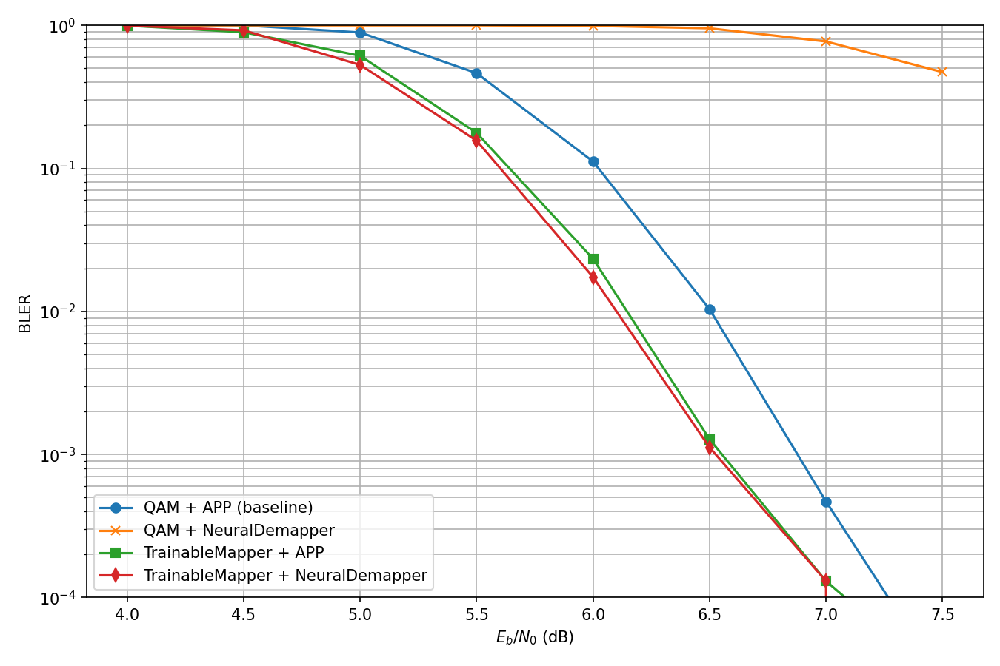
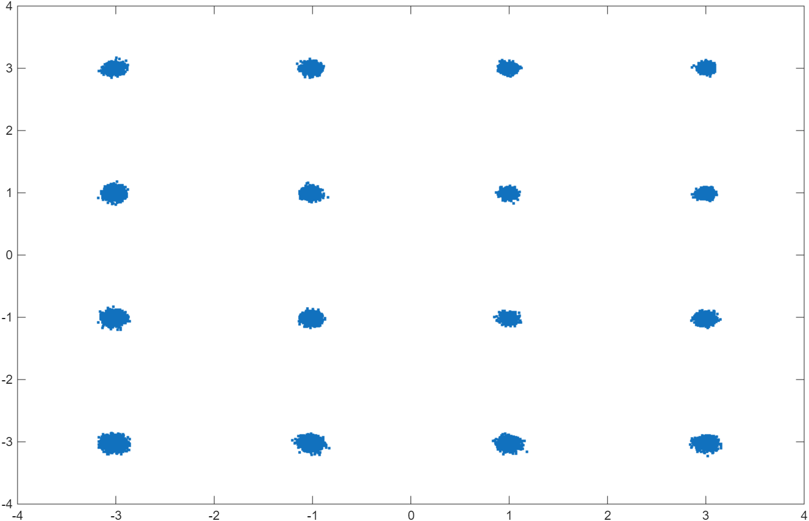
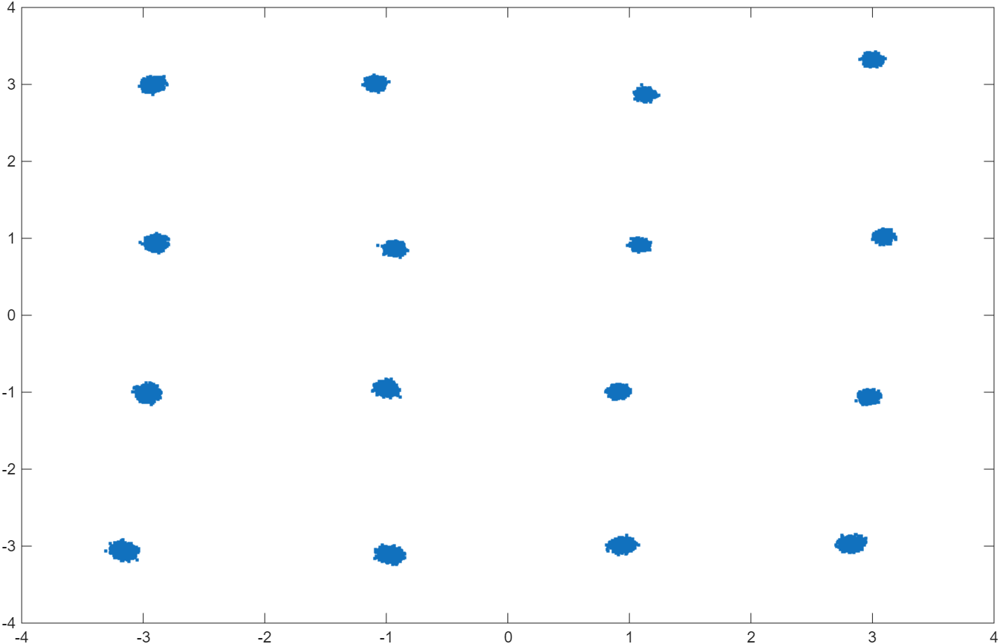
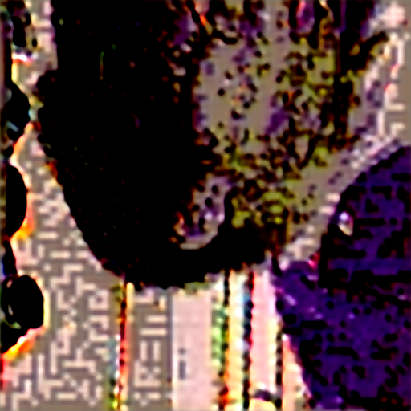

# Results and interpretation

## Edge latency

The archived Jetson Orin experiment reported:

| Stage | Regular execution | Optimized execution | Reduction |
|---|---:|---:|---:|
| TX VAE feature extraction | 798.1 ms | 258.2 ms | 67.65% |
| TX LDPC + modulation | 88.3 ms | 7.4 ms | 91.62% |
| RX demodulation + LDPC | 1380.9 ms | 110.0 ms | 92.03% |
| RX VAE reconstruction | 1197.6 ms | 264.2 ms | 77.94% |
| **End to end** | **3464.9 ms** | **639.8 ms** | **81.54%** |

These are experiment results, not library benchmarks. Precision, warm-up,
JetPack/runtime versions, power mode, clocks, and input shape can materially
change them.

## Physical-layer ablation

The selected BLER record compares fixed QAM / APP demapping, neural demapping,
and a trainable constellation under the archived simulation configuration.

The JSON source is `results/phy_ablation.json`. Some early neural-only variants
underperformed the conventional baseline; the repository preserves this result
because negative ablations are part of the engineering evidence. The strongest
claim supported by the experiment is improved mapper/demapper matching in the
tested configuration, not universal neural superiority.

## Over-the-air constellation observations

At the tested PA gains, the learned 16-QAM constellation showed clearer received
clusters and more stable class separation than standard 16-QAM. The following
figures are representative measurements, not statistically complete channel
models.

| Standard QAM | Learned constellation |
|---|---|
|  |  |

## Semantic image quality

The thesis reports a mean PSNR of 28.10 dB and mean SSIM of 0.982 across the
selected real-link reconstructions; the worst archived sample remained at
24.22 dB PSNR and 0.940 SSIM. A small smoke-test record is included as
`results/reconstruction_smoke.json`.

## Reproduction boundary

The repository includes code and compact measurements, but not all original
weights, raw captures, or device engines. Exact numerical reproduction requires
the missing artifacts and matching hardware. The included material supports
code inspection, simulation reruns, and reconstruction of the deployment flow.

